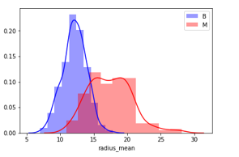
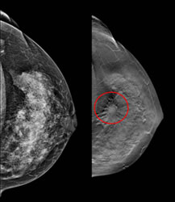
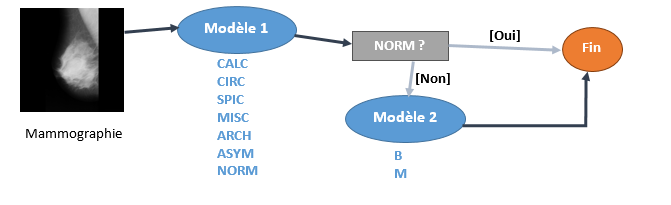
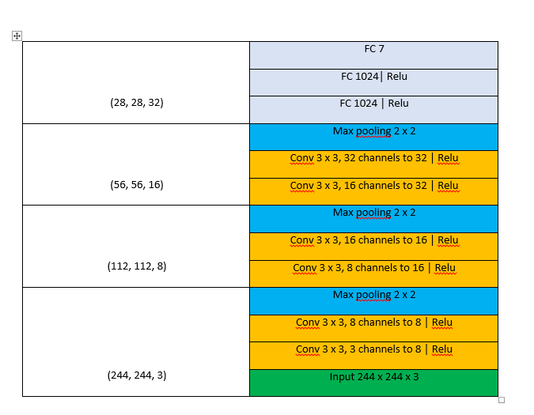
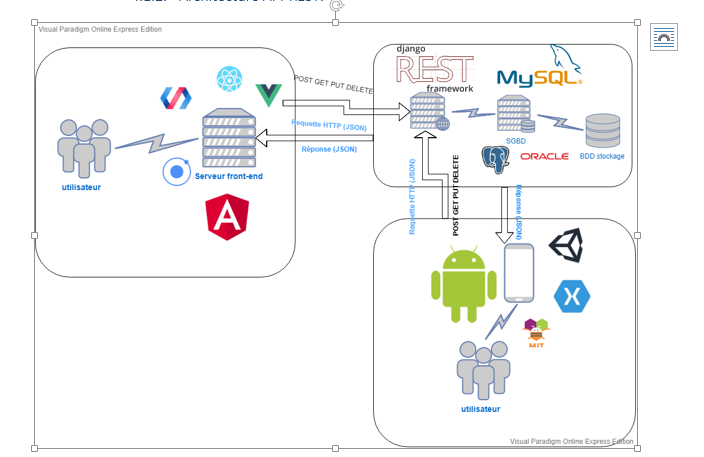
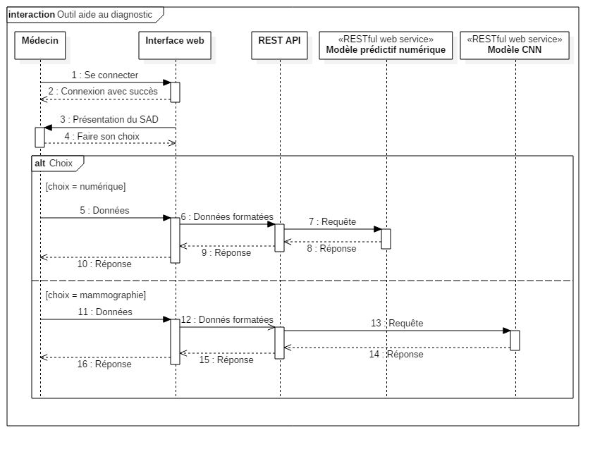
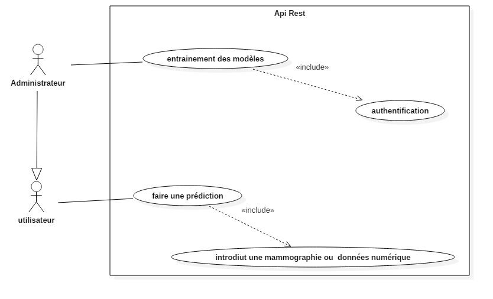

#  NCan-Api-Front-end

A rest full api to detection of breast cancer developed with  [Flask](https://palletsprojects.com/p/flask/) version 1.1.1 , [Pytorch](https://pytorch.org/) version 1.2 and [scikit-learn](https://scikit-learn.org/stable/) version 0.21.3.

## Introduction
In women, breast cancer remains the most common and deadliest cancer. Each year, there are nearly 1.38 million new cases and 458,000 deaths from breast cancer (IARC Globan, 2008). This type of cancer is widespread in both developed and developing countries. In Algeria, 12,000 new cases are registered each year.
In the vagueness that still surrounds the causes of this cancer, screening and early diagnosis remain the main means of fighting this disease. Breast cancer detected at an early stage can be controlled and treated. Conversely, if it is detected late, there is little chance that the curative treatment is really effective.
Mammography is the main radiographic examination for the detection and detection of tissue abnormalities. If the interest of this examination is undeniable, the interpretations and the follow-up to give to its results still debate. In fact, the question arises as to the first comment to be made, the need for a biopsy or the appropriate interval between two successive mammograms.
## Discription 
This project is the Rest full API contains a models (numeric and mammography) to predict breast cancer.
## Installing
You have to install:
<lu>
<li> python 3.6</li>
<li> Pytorch 1.2</li>
<li> scikit-learn 0.21.3</li>
<li> Flask 1.1.1</li>
</lu>

## structure
this project is divided in 2 parts :
<lu>
<li> <b>app.py</b> :   predict from numerical values</li>
<li> <b>app2.py</b> :   predict from Mammography images</li>
</lu>

##  predictive models
### models for numeric values 
####   The dataset 
We have worked in this part on a very famous dataset: the Breast Cancer Wisconsin (Diagnostic) Data Set. As described by the authors, features are extracted from digitized images of fine needle biopsy (FNA) on a breast mass. These features describe the characteristics of the cell nucleus visible on the image. The dataset consists of 569 rows and 32 attributes. The label is binary: benign or hand. We were interested in our study only to 10 attributes that correspond to the average of the measured characteristic. These attributes are listed below. 
<lu> 
<li>Radius (mean of distances from center to points on the perimeter);</li>
<li>Texture (standard deviation of gray-scale values);</li>
<li>Perimeter ;</li>
<li>Area;</li>
<li>Smoothness (local variation in radius lengths);</li>
<li>Compactness (perimeter^2 / area - 1.0) ;</li>
<li>Concavity (severity of concave portions of the contour);</li>
<li>Concave points (number of concave portions of the contour);</li>
<li>Symmetry ;</li>
<li>Fractal dimension ("coastline approximation" - 1).</li>
</lu>

####  Analyse des données

   
A brief analysis of the dataset allowed us to understand the data, to see some links between the attributes and to make a certain number of hypotheses, but it is impossible to go further in the interpretation without a deep knowledge of the field or the intervention of a specialist. The above figure, for example, indicates that a smaller radius would herald a clever case, but we can not draw any formal conclusions from it.

#### Construction du modèle
  
We made the choice to work with the scikit-learn library to build our models and to train them on the dataset. A quick overview of the figure below (provided in the scikit-learn documentation) allows you to select the most suitable models for our data and needs.
 

 
We tested five models based on five different algorithms: LinearSVC, KNeighborsClassifier, SVC, RandomForestClassifier, ExtraTreesClassifier. We shared the dataset in three (training, validation and testing) and for each model we did a training, a validation and finally a test.
 

| Modèle|  Précision | 
| ------------- |:-------------:| 
|  **Extra Trees**      | 97.94% | 
|  **Random Forest**      | 94.74%   |  
| **KNeighborsClassifier** | 89.47%     |   
| SVC |76.32%      | 
|LinearSVC | 73.68%      | 
 
We kept the three best models. In the prediction function, a prediction (benign or malignant) is made by each of the three models, then the most redundant prediction is made.

### models for mammography images  
####   The dataset 
  
We worked on an open dataset (The mini-MIAS database of mammograms) containing 322 labeled mammograms. Labels are contained in the file "info.txt". Each mammogram is labeled in several columns. We were interested here only in the third and fourth columns.
 
The third column represents the class of the anomaly. There are seven classes in all:
 
<lu> 
<li><b>CALC</b> Calcification</li>
<li><b>CIRC</b> Well-defined/circumscribed masses</li>
<li><b>SPIC</b> Spiculated masses</li>
<li><b>MISC</b> Other, ill-defined masses</li>
<li><b>ARCH</b> Architectural distortion</li>
<li><b>ASYM</b> Asymmetry</li>
<li><b>NORM</b> Normal</li>
</lu>
 
The fourth column represents the severity of the anomaly.
 
<lu> 
<li><b>B</b> Benign</li>
<li><b>M</b> Malignant</li>
</lu>
 
  
If there is no anomaly (NORM in the third column), the question of severity naturally does not arise. The fourth column is empty in this case.
 

 
  
Columns 5, 6 and 7 indicate respectively the two coordinates and the radius of a circle surrounding the suspect zone. The figure above, for example, shows a circle in red around the area, this information is extracted from the columns mentioned.

####  Deep Learning
  
We will use deep learning to build models that can detect the class and severity of a mammary abnormality from a mammogram. We will make a diagnosis at two levels: first the class among seven predefined classes, then the severity (benign or malignant).
 

 
  
After several tests, we arrived at the architecture below. A deeper architecture would bring the model to better know the data but could cause other problems (like the evanescence of the gradient). This model gives an accuracy of 54% after a training of 300 eras.
 

 
The same architecture has been adopted for the second model (benign / malignant) by changing the last layer (an FC with two outputs). The accuracy is 91%.
#### Transfer learning
  
It's about using a pre-trained model by modifying its classifier and dragging it on our data for a few extra times. This technique gives excellent results and saves a lot of computing time. Because it involves training the model only once on a large amount of data and reusing it to solve completely different problems by dragging it for only a few additional times.
 
  
For our part, we used a ResNet18 pre-trained on ImageNet. This model gives for our two models an accuracy of respectively 63% and 98%.
## Architcture rest
  
A user can connect through a web application or a mobile application to a Django Rest server via http requests (POST, GET, PUT, DELETE), which will handle the data entered by the user, to then return a response (JSON) to the user containing the result, as well as save the new data to the database
 

## UML Diagrams
### sequence diagram

This sequence diagram to show how this project intercat with Api

### Uses Cases diagram
This Uses Cases   diagram to show how you can use this application 

## Contributors
<lu>
<li> SIDI MOHAMED HICHAM Zekri</li>
<li> GHILES Meddour</li>
<li> ANWAR Selmi</li>
<li> ZINEB Cherki</li>
</lu>
